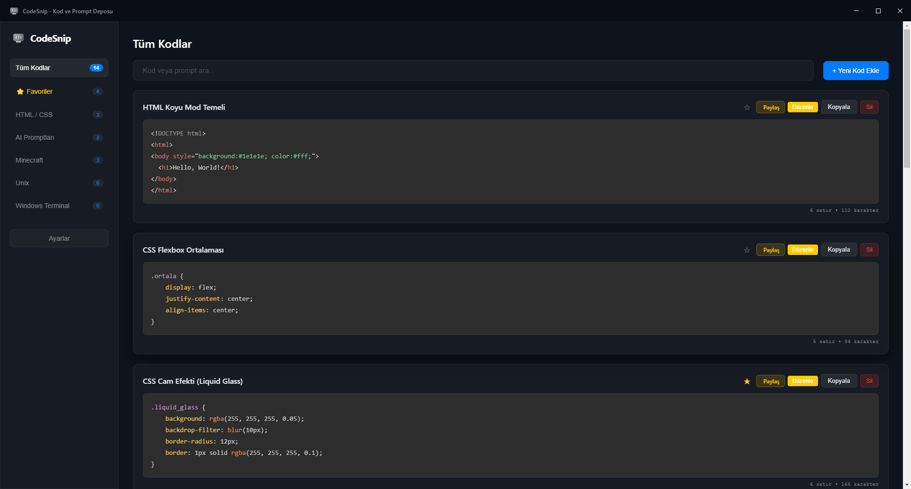
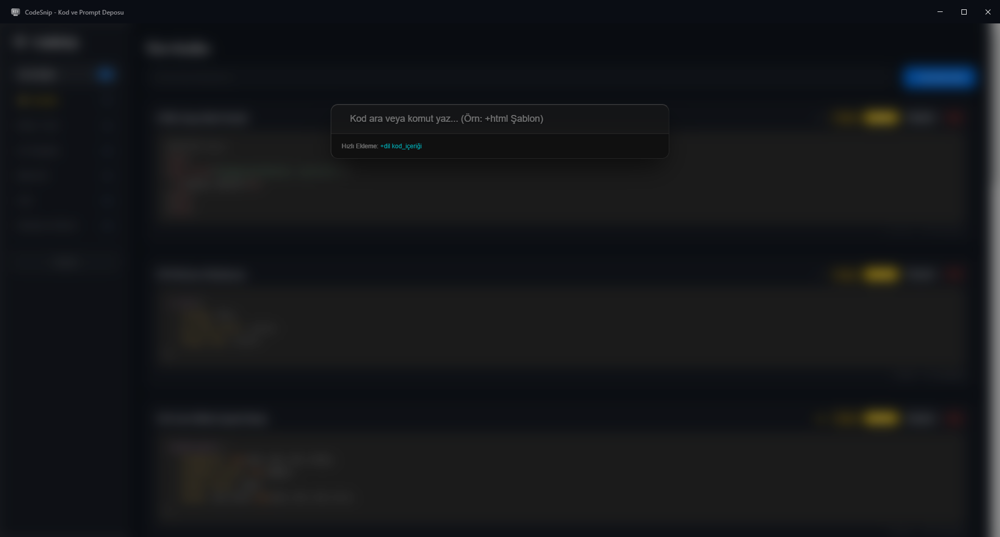

# CodeSnip — Yeni Nesil Kod ve İstemi Yöneticisi

<p align="center">
  
  
</p>

<p align="center">
  <a href="README.md"></a>
  <a href="README.en.md"></a>
</p>

<p align="center">
  Modern, hızlı ve tamamen çevrimdışı çalışan bir masaüstü kod ve AI prompt yöneticisi.<br>
  Kod parçalarını, terminal komutlarını ve prompt'larınızı tek bir uygulamada düzenleyin, arayın ve paylaşın.
</p>

---

## Hakkında

CodeSnip; geliştiriciler, tasarımcılar ve yapay zekâ ile çalışan kullanıcılar için geliştirilmiş modern bir Electron uygulamasıdır.
Kod parçalarını kategorilere ayırabilir, anında arayabilir, tek tıkla kopyalayabilir ve Base64 tabanlı paylaşım bağlantıları oluşturabilirsiniz.
Tüm veriler cihazınızda saklanır ve uygulama internet bağlantısı gerektirmeden çalışır.

> [!NOTE]
> Uygulama tamamen çevrimdışı çalıştığı için verileriniz güvendedir.

---

## Özellikler

- Liquid Glass (Buzlu Cam) kullanıcı arayüzü
- Global Spotlight arama (`Ctrl + Space`)
- Base64 tabanlı paylaşım sistemi
- Türkçe ve İngilizce dil desteği
- Tamamen çevrimdışı çalışma
- Yerel veri depolama
- Hazır kategori sistemi
- Hızlı arama ve filtreleme
- Electron tabanlı masaüstü uygulaması

---

## Kurulum

### Gereksinimler

- Node.js (18 veya üzeri önerilir)
- npm

### Depoyu klonlayın

```bash
git clone https://github.com/MstfSlm38/CodeSnip.git
cd CodeSnip
```

### Bağımlılıkları yükleyin

```bash
npm install
```

### Geliştirici modunda çalıştırın

```bash
npm start
```

### Üretim sürümünü oluşturun

```bash
npm run build
```
---

## Ekran Görüntüleri

<p align="center">

<br><br>

</p>


---

## Klavye Kısayolları

| Kısayol | Açıklama |
|---------|----------|
| `Ctrl + Space` | Spotlight aramasını açar veya kapatır |
| `Esc` | Açık pencereyi kapatır |

---

## Kullanılan Teknolojiler

- Electron
- JavaScript
- HTML5
- CSS3

---

## Yol Haritası

- [x] v2.0 — Spotlight, Paylaşım ve yenilenen Liquid Glass tasarımı
- [ ] v2.5 — JSON dışa/içe aktarma
- [ ] v3.0 — İsteğe bağlı uçtan uca şifreli bulut senkronizasyonu
- [ ] v3.5 — Visual Studio Code uzantısı
- [ ] v4.0 — Eklenti (Plugin) sistemi
