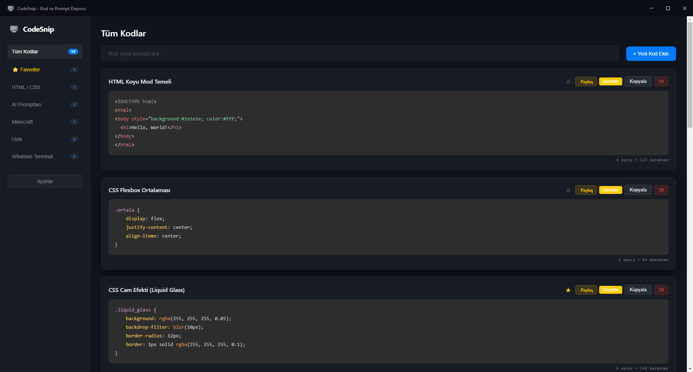
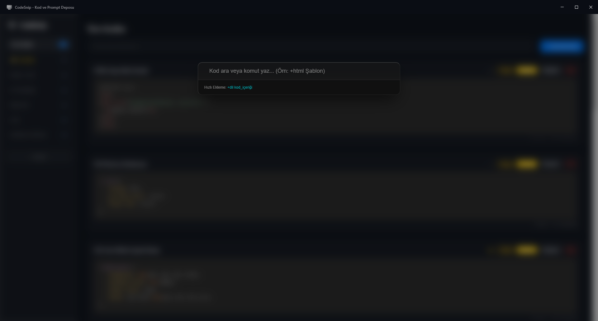

# CodeSnip — Yeni Nesil Kod ve İstemi Yöneticisi

<p align="center">
  
  

</p>

<p align="center">
  <a href="README_tr.md"></a>
  <a href="README.md"></a>
</p>

<hr>

<p align="center">
  Modern, hızlı ve tamamen çevrimdışı çalışan bir masaüstü kod ve AI prompt yöneticisi.<br>
  Kod parçalarınızı, terminal komutlarınızı ve prompt'larınızı tek bir uygulamada düzenleyin, arayın ve paylaşın.
</p>


---

## Hakkında

CodeSnip; geliştiriciler, tasarımcılar ve yapay zekâ ile çalışan kullanıcılar için geliştirilmiş modern bir Electron uygulamasıdır.
Kod parçalarını kategorilere ayırabilir, anında arayabilir, tek tıkla kopyalayabilir ve Base64 tabanlı paylaşım bağlantıları oluşturabilirsiniz.
Tüm veriler cihazınızda saklanır ve uygulama internet bağlantısı gerektirmeden çalışır.

> [!TIP]
> Uygulama tamamen çevrimdışı çalıştığı için verileriniz güvendedir.

---

## Özellikler

- Liquid Glass (Buzlu Cam) kullanıcı arayüzü
- Global Spotlight arama (`Ctrl + Space`)
- Base64 tabanlı paylaşım sistemi
- Türkçe ve İngilizce dil desteği
- Tamamen çevrimdışı çalışma
- Yerel veri depolama
- Hazır kategori sistemi
- Hızlı arama ve filtreleme
- Electron tabanlı masaüstü uygulaması

---

## Kurulum

### Gereksinimler

- Node.js (v18 veya üzeri)
- npm

### 1- Depoyu klonlayın

```bash
git clone https://github.com/Light-Bulb-Team/CodeSnip.git
```

### 2- Oluşturulan Klasöre Gidin

```bash
cd codesnip
```

### 3- Bağımlılıkları yükleyin

```bash
npm install
npm install electron --save-dev
```

### 4- Üretim sürümünü paketleyin

```bash
npm run dist
```
---

## Ekran Görüntüleri

<p align="center">

<br><br>

</p>

---

## Beta Ekran Görüntüleri

> [!WARNING]
> Bunlar beta ekran görüntüleridir. Çoğu şeyler zamanla değişebilir.

<p align="center">

<br><br>

</p>

---
## Klavye Kısayolları

| Kısayol | Açıklama |
|---------|----------|
| `Ctrl + Shift + S` | **Global Kısayol:** Uygulama arkada açık olsa bile ekrana getirir ve Spotlight aramayı açar. |
| `Ctrl + Space` | Uygulama içindeyken Spotlight arama panelini hızlıca açar veya kapatır. |
| `Esc` | Açık olan Spotlight arama panelini kapatır. |
| `Space` | Spotlight arama listesindeyken seçili kodun **Quick Look (Hızlı Önizleme)** panelini açar. |
| `Arrow Up / Down` | Spotlight arama sonuçları arasında yukarı-aşağı gezinmeyi sağlar. |
| `Enter` | Spotlight aramasında seçilen kodu ana arama çubuğuna aktarır (Veya `+kategori` formatındaysa hızlı kod ekler).

---

## Kullanılan Teknolojiler

- Electron
- JavaScript
- HTML5
- CSS3
- Node.js

---

## Yol Haritası
- [x] v1.0 — İlk Sürüm
  - [x] v1.1 — Hotfix ve Favorileme Özelliği
- [x] 26Q2 (v2.0) — Spotlight, Paylaşım ve Yenilenen Liquid Glass Tasarımı
  - [x] 26Q2.5 — JSON dışa/içe aktarma, Daha İyi Spotlight ve Sürüm İsmi Değişikliği
- [x] 26Q3 — Linux (Debian, Arch, Red Hat) Desteği, Daha iyi Görünüm, Kişiselleştirme ve Kategori Yönetimi
	- [x] 26Q3.1 — Kritik Hotfixler
	- [x] 26Q3.5 — Önemli Hotfixler, Yeni İspanyolca Dil Desteği ve Açık Tema İyileştirmeleri
- [ ] 26Q4 — Uygulama Optimizasyonu, macOS Linux İçin Tam Destek (Slackware ve Gentoo)
- [ ] 27Q1 — Eklenti (Plugin) sistemi ve Kod Önizlemesi

>[!NOTE]
>Yol haritası yeni özelliklerden veya çıkan buglardan dolayı zamanla değişebilir.

## Katkıda Bulunma

Projeyi geliştirmemize yardımcı olmak ister misiniz? 
-  Bu depoyu fork edin (`Fork` butonuna basın).
-  Yeni bir özellik için dal oluşturun (`git checkout -b yeni-ozellik`).
-  Değişikliklerinizi kaydedin (`git commit -am 'Yeni özellik eklendi'`).
-  Dalınızı gönderin (`git push origin yeni-ozellik`).
-  Bir **Pull Request** (Değişiklik İsteği) oluşturun.
-  Ya da eğer proje'de hata bulursanız Issues kısmından bize bildirmekten çekinmeyin!

## Lisans

Bu proje **MIT Lisansı** ile lisanslanmıştır. Detaylar için [LICENSE](LICENSE) dosyasına göz atabilirsiniz.

## Geliştiriciler

- Mustafa Selim AYDENİZ
